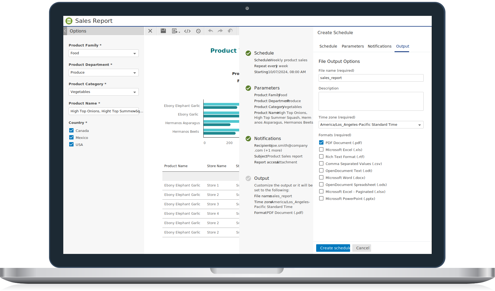

    <h1 class="title">Jaspersoft Visualize Components</h1>
    
Enhance your web application with JasperReports Server&#xae;, embed reports, or build custom workflows using modern React components.

    

        <a class="cta-text" href="pages/introduction.html">Get started</a>
    

    

        
    

    

       <h3>Modern</h3>
       
Built with TypeScript, Vite, React, and Material UI, our Visualize Components are designed to operate in any web development environment and integrate seamlessly into your Visualize.js projects.

    

    

       <h3>Configurable</h3>
       
We've designed the Visualize Components with flexibility in mind. You can extend and customize them to match your application's unique style and requirements.

    

    

       <h3>Accessible</h3>
       
Visualize Components come with built-in keyboard navigation and screen reader support, saving you valuable development time and ensuring your projects are inclusive from the start.

    

    

       <h3>Open Source</h3>
       
Our components are completely free, giving you the power to bring your applications to life without any restrictions. You have the full freedom to use, customize, and even redistribute it within your own projects.

    

    <h2>Components</h2>
    

        

           

           <h3>Input Controls</h3>
           
Easily add interactive filters, date pickers, and other input controls to your web applications. This plugin streamlines the integration of JasperReports Server reports and visualizations, giving users greater control over their data exploration.

            

                <a class="cta-text" href="pages/input-controls/basic-usage.html">Get started</a>
            

        

        

           

           <h3>Scheduler</h3>
           
This powerful component allows users to schedule reports and dashboards with ease. Built on the Visualize.js API, the scheduler integrates seamlessly  with JasperReports Server.

            

                <a class="cta-text" href="">Get started</a>
            

        

    

