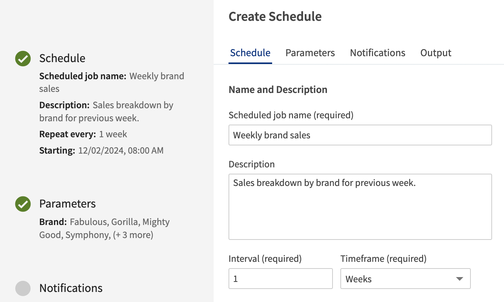

    <h1 class="title">Jaspersoft Visualize Components</h1>
    
Enhance your web app with JasperReports Server, embed reports, or build custom workflows using modern ReactJS components.

    

        <a class="cta-text" href="pages/introduction.html">Get started</a>
    

    

        
    

    

       <h3>Modern</h3>
       
Built with TypeScript, Vite, ReactJS, and Material UI components this project seeks to provide a cutting-edge development experience. These tools enable developers to build components at a faster pace with higher quality than vanilla JavaScript experience.

    

    

       <h3>Configurable</h3>
       
This project aims to be highly configurable for the end user to have control over the look and feel of their application. While the project will offer some configuration options, most components will allow users to implement their own components with a shared interface.

    

    

       <h3>Accessible</h3>
       
Visualize Toolkit aims to provide components that are built to be accessible out of the box. Keyboard navigation and screen reader support should be available for all components.

    

    

       <h3>Open Source</h3>
       
Visualize Toolkit will be open source and free to use, modify and redistribute as part of your own application. We also welcome contributions back to the project.

    

    <h2>Components</h2>
    

        

           

           <h3>Input Controls</h3>
           
The Input Controls plugin is a set of components that allows you to render input controls in your web application. The plugin is built on top of the Visualize.js API and is used to interact with JasperReports Server reports and visualizations.

            

                <a class="cta-text" href="pages/input-controls/basic-usage.html">Get started</a>
            

        

        

           

           <h3>Scheduler UI</h3>
           
The Scheduler UI is a plugin that can be embedded in a web application that allows you to schedule reports and dashboards. The plugin uses the Visualize.js API to interface with JasperReports Server reports and visualizations.

            

                <a class="cta-text" href="">Get started</a>
            

        

    

