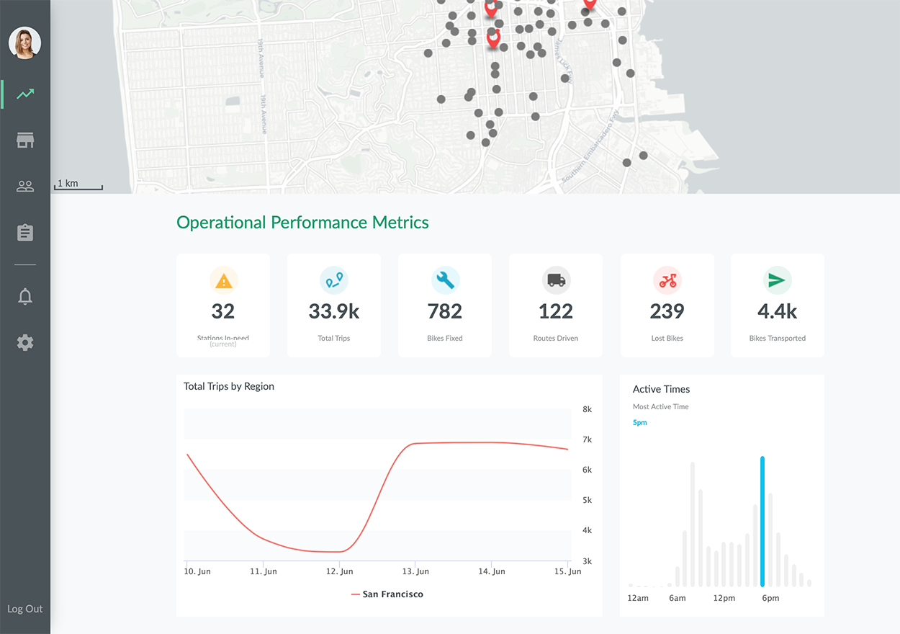
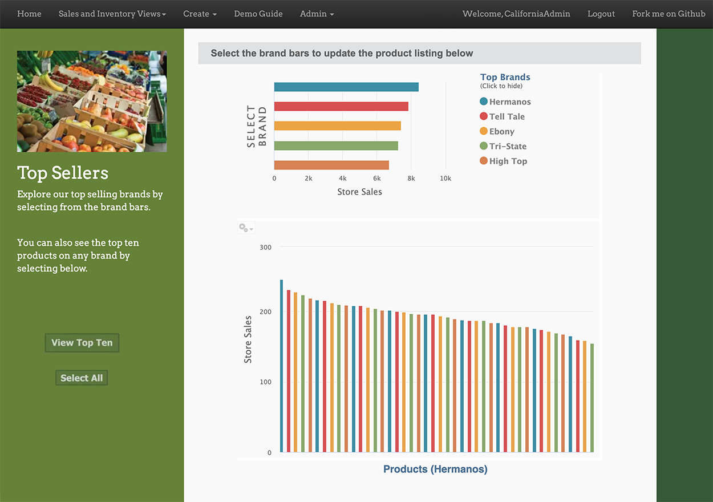
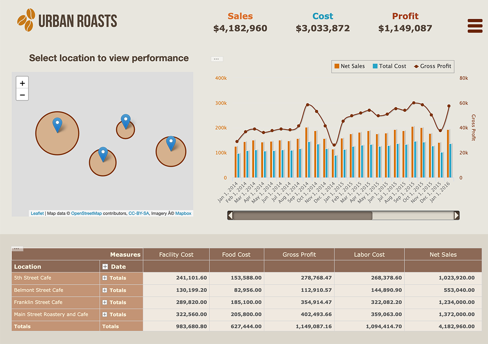

# Demos

Interact with actual applications that feature embedded Jaspersoft reports, dashboards, and data visualizations.
{: .fs-6 .fw-300 }

---

## Bikeshare

The Bikeshare app puts actionable data front and center through the use of embedded reports and data visualizations.

Try out the <a href="https://demo.jaspersoft.com/bikeshare/" target="_blank">Bikeshare live demo</a>.

## Fresh Delivery

The Fresh Delivery app is designed to showcase the features of TIBCO Jaspersoft's embedded analytics framework and highlights Visualize.js. The reports included in this demo app depend on the Foodmart sample dataset that is provided in the standard trial installation of JasperServer Professional.

Try out the <a href="https://demo.jaspersoft.com/fresh-delivery/top-sellers.html" target="_blank">Fresh Delivery live demo</a>.

## Urban Roasts

The Urban Roasts app uses custom JavaScript visualizations and Jaspersoft embedded analytics, and is developed purely with Jaspersoft's web-based design tools.

Try out the <a href="https://demo.jaspersoft.com/urban-roast/cafe.html" target="_blank">Urban Roasts live demo</a>.

